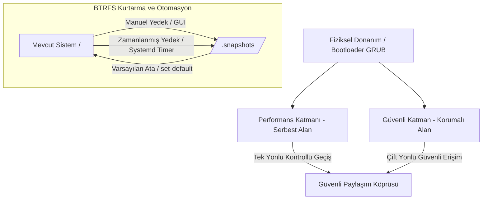

# DualCoreX - Sistem Modelleri (System Patterns)

## Sistem Mimarisi (System Architecture)
DualCoreX, güvenlik ve performans gereksinimlerini karşılamak adına **Çift Katmanlı İzolasyon (Dual-Domain Isolation)** mimarisini benimser. 

Sistemin kurtarılabilmesi amacıyla **BTRFS Snapshot & Geri Yükleme Yönetimi** ve **Zamanlanmış Otomatik Yedekleme** entegre edilmiştir.

## BTRFS Snapshot Yönetim Modeli

### X11 ve Wayland Altında Yetki Yükseltme Mimarisi
1. Kullanıcı uygulamayı (`main.py`) çalıştırır.
2. `elevate_privileges()` fonksiyonu etkin kullanıcı kimliğini (`os.geteuid()`) denetler.
3. Yetki `root` (0) değilse, arka planda `xhost +local:` çalıştırılarak yerel XWayland/X11 bağlantılarına izin verilir.
4. Çevre değişkenleri (`DISPLAY`, `XAUTHORITY`, `WAYLAND_DISPLAY`, `XDG_RUNTIME_DIR`) okunur ve `pkexec env ...` parametreleri olarak tanımlanır.
5. Polkit grafiksel parola sorma penceresi tetiklenir ve yetkilendirilen uygulama hem X11 hem de Wayland oturumlarında root yetkileriyle başarılı bir şekilde GUI çizer.

### Systemd Otomatik Yedekleme Entegrasyonu (2 Saatte Bir)
- **Checkbox İş Mantığı:** GUI üzerindeki Checkbox tıklandığında `setup_auto_backup` çağrılır.
- **Service (`btrfs-autosnap.service`):** `/etc/systemd/system/` altında oluşturulur ve `python3 btrfs_helper.py --auto` komutunu `oneshot` olarak çalıştırır.
- **Timer (`btrfs-autosnap.timer`):** 2 saatlik periyotlarla (`OnUnitActiveSec=2h`) tetikleme yapar ve sistem açıldıktan 10 dakika sonra ilk yedeği alır.
- **Zamanlayıcı Durumu:** `systemctl enable/start/stop/disable` komutlarıyla dinamik olarak yönetilir.

## Tasarım Kalıpları (Design Patterns)
- **Zamanlanmış Görev Tasarım Kalıbı (Scheduled Task Pattern):** Uygulama kapalıyken bile çalışması gereken yedekleme işleri, işletim sisteminin yerel zamanlayıcılarına (systemd timers) delege edilmiştir.
- **Grafik Sunucusu Soyutlama Kalıbı (Display Server Abstraction):** X11 ve Wayland detayları Polkit ve xhost köprülemesiyle soyutlanarak uygulamanın ekran sunucusundan bağımsız kararlı çalışması sağlanmıştır.
- **Sıfır Güven (Zero Trust) Modeli:** Silme ve geri yükleme işlemlerinde yol kontrolü yapılarak yetkisiz dizinlerin manipülasyonu engellenir.
